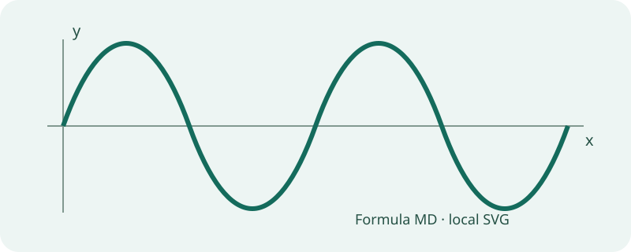

# 图片与公式

本示例完全离线。下面的 SVG 与这份 Markdown 一起保存，路径以本文档目录为基准。

同一段正文可以混合图片与数学公式：

$$y(x)=A\sin(kx+\varphi),\qquad k=\frac{2\pi}{\lambda}.$$

## 引用式图片

![引用式波形][wave]

[wave]: <images-showcase.assets/wave.svg>

## HTML 图片

可通过工具栏的“插入图片”、拖入或在编辑区粘贴添加图片。新图片将复制到 `images-showcase.assets/`。分享时请同时保留该目录。
